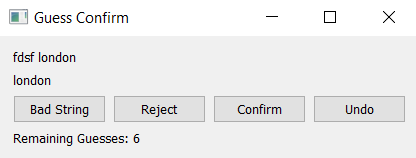

# Readme

This is a simple app, used to detect whether strings have been cleaned correctly.

The app takes an input file consisting of a string, cleaning guess, and a correct column,
the user then determines whether the string was correctly parsed/cleaned by clicking one of three
buttons: 'bad string', 'confirm', and 'reject'. 'bad string' marks the input string as bad, and
uncleanable. 'reject' marks the guess as invalid, and marks all guesses that are the same as invalid.
'confirm' marks the guess as valid, and marks all guesses that are the same as valid. 'undo' undoes
past work. 'bad string' is keybound to 'a', 'reject' to 'w', 'confirm' to 'd'.

You can change the guess file path in "guess_confirm_app.py" 
`guess_path = "../guess.csv"`

A sample guess file is "guess.csv"

## Image of App

# Future Updates:
* Making Undo only record last n operations. Currently it records all operations, which could
lead to a perfomance issue. Note: undo is refreshed at app start.
* Could add file menu to make inputting files easier